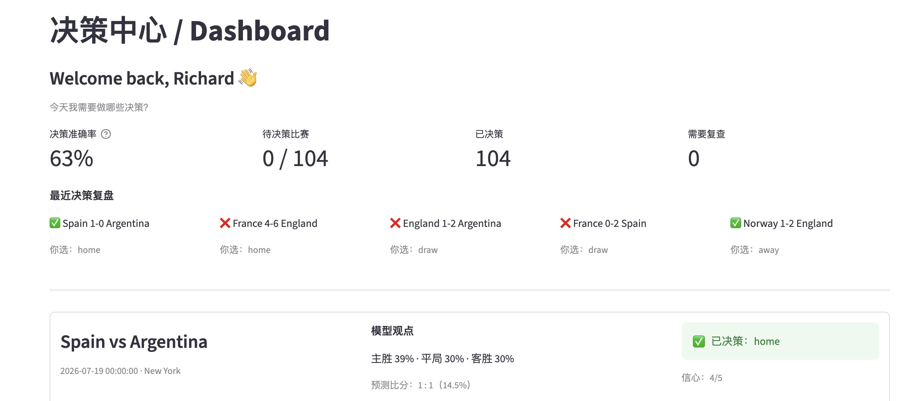
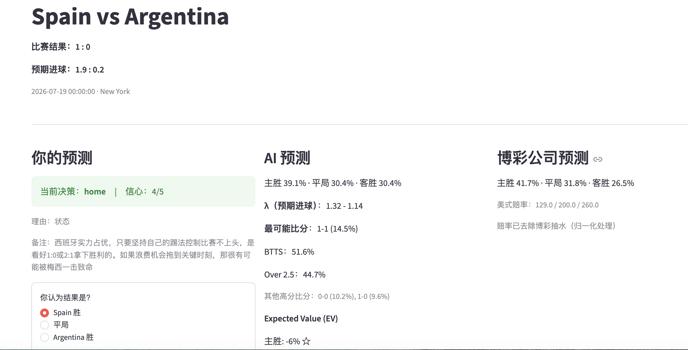
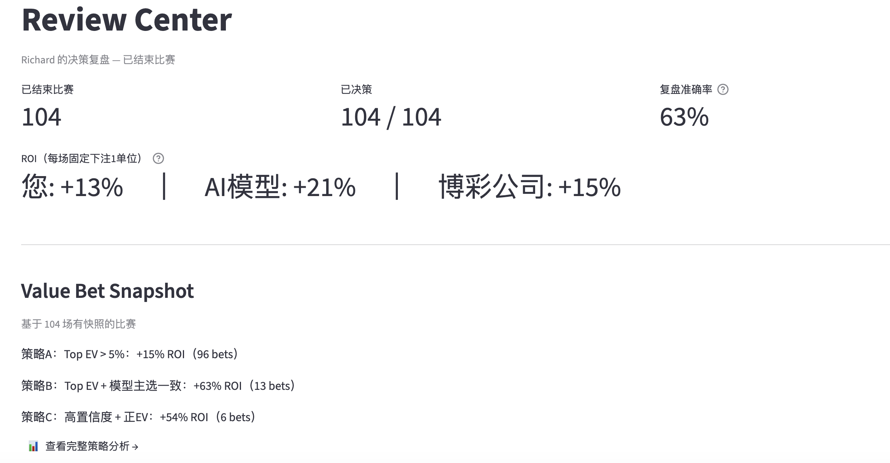
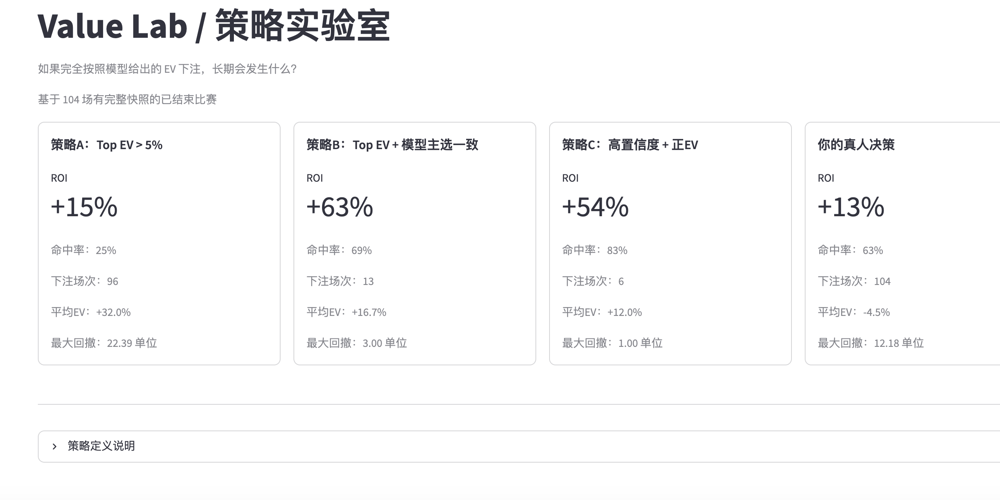

# ⚽ Decision Copilot

> **Decision Copilot is not only a football prediction system.**  
> It is an **AI Decision Intelligence platform**, using football as its first real-world laboratory.

Inspired by Decision Science, Sports Analytics, and Explainable AI.

---

## 📸 Screenshots

| Dashboard | Match Detail |
| :---: | :---: |
|  |  |

| Review Center | Value Lab |
| :---: | :---: |
|  |  |

---

## 🎯 Why This Project?

Most football AI projects try to answer:

> **Who will win?**

Decision Copilot asks a different question:

> **Why did I make this decision? Can I become a better decision maker?**

Prediction is only one component. **Decision quality is the real objective.**

---

## 🧠 Research Inspirations

| Area | Influence |
| :--- | :--- |
| **Football Prediction** | Dixon-Coles model, Elo ratings, 2023 Soccer Prediction Challenge|
| **Decision Science** | Behavioral Finance, Decision Theory, Human‑in‑the‑loop Decision Systems |
| **Sports Analytics** | Tournament Design, Fairness, Incentive Design |

---

## ✨ Core Features

### 📊 **Match Detail & Decision Journal**
For each match, record your prediction, confidence, scoreline, and reasoning alongside:
- **Model Prediction**: Win/draw/loss probabilities, expected goals (`λ`), most likely score, BTTS, Over/Under.
- **Market Snapshot**: Real-time bookmaker odds and implied probabilities.
- **Expected Value (EV)**: Calculate whether a bet is mathematically worthwhile.
- **Feature Attribution**: Understand which factors (Elo difference, market value, form, home advantage) drove the AI's prediction.

### 🔍 **Review Center & AI Coach**
- **Performance Dashboard**: Track your ROI, accuracy, and compare against AI and bookmaker models.
- **AI-Powered Post-Match Review**: Using Claude API, analyze *why* a decision was good or bad, identify cognitive biases, and receive actionable recommendations.
- **Value Bet Snapshot**: See how different betting strategies (e.g., Top EV, Model-Agree EV) would have performed.

### 📈 **Value Lab & Diagnostics**
- **Strategy Backtesting**: Test three value-betting strategies (Top EV, Model-Agree, High Confidence) on your historical decisions.
- **Systematic Bias Analysis**: Identify where your model systematically overestimates underdogs or misprices draws.
- **Model Evaluation**: Assess model performance using Brier Score, RPS (Ranked Probability Score), and ECE (Expected Calibration Error).

### ⚙️ **Transparent & Interpretable AI**
The core prediction model is a **Ridge regression with Dixon-Coles correction**, currently using only four features:
- **Elo Rating Difference** (from ClubElo)
- **Market Value Ratio** (from Transfermarkt)
- **Weighted xGD** (Recent goal-difference form, time-decayed)
- **Home Advantage**

This simplicity ensures the model's decisions can be explained and challenged, unlike a black-box system.

---

## 🏗️ Decision Flow
Football Data
│
▼
Prediction Model (Ridge + Dixon‑Coles)
│
▼
Decision Snapshot
│
▼
Human Decision (Prediction + Confidence + Reasoning)
│
▼
Post-match Outcome
│
▼
AI Review (Claude API)
│
▼
Decision Dataset
│
▼
Better Future Decisions

text

---

## 🗺️ Future Roadmap

| Phase | Goal |
| :--- | :--- |
| **Phase 1** | Explainable Football Prediction | ✅ |
| **Phase 2** | Decision Review + AI Coach | ✅ |
| **Phase 3** | Personalized AI Coach + User Profiling | 🚧 In Progress |
| **Phase 4** | Decision Intelligence Platform | 🔮 Future |
| | → Football → Sports → Investment → Business Decisions |

---

## 🚀 Quick Start

Site available on https://decision-copilot-worldcup.streamlit.app/
To test code locally:

1. **Clone the repository**:
   ```bash
   git clone https://github.com/Richardwu3/decision-copilot.git
   cd decision-copilot
Install dependencies:

2. **Install dependencies**:
   ```bash
   pip install -r requirements.txt
   ```

3. **Configure API Keys** (for AI Coach):
   Create a `.streamlit/secrets.toml` file in the project root:
   ```toml
   ANTHROPIC_API_KEY = "your-anthropic-api-key"
   ```

4. **Run the application**:
   ```bash
   streamlit run app.py
   ```

5. **Log in** with any username to start recording and reviewing decisions. My decisions available with username `Richard`

## 📊 Model Performance (2026 World Cup)

On 104 World Cup matches, the model demonstrated robust predictive power, slightly outperforming bookmaker probabilities in both Brier Score and RPS after calibration.

| Metric | Decision Copilot (Calibrated) | Bookmaker |
| :--- | :--- | :--- |
| **Multiclass Brier Score** | **0.4518** | 0.4685 |
| **RPS (Ranked Probability Score)** | **0.1380** | 0.1482 |

**Additional Training & Validation Metrics:**
*   **Training Set (2,300 matches)**: RMSE 1.1521, R² 0.2382
*   **Out-of-Fold (OOF) Test**: Brier 0.5439, RPS 0.1855

🙏 Acknowledgements
Yujun for collaboration and feedback.

Professor Julien Guyon for his inspiring work on tournament design, fairness, and decision science in sports.

Open-source projects and data providers: WorldElo, Transfermarkt, FootyData, 2023 Soccer Prediction Challenge.